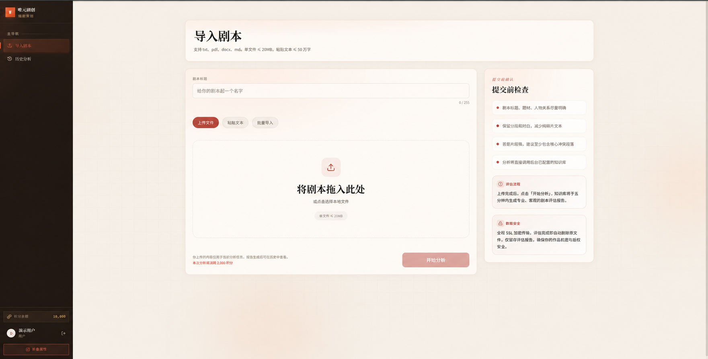
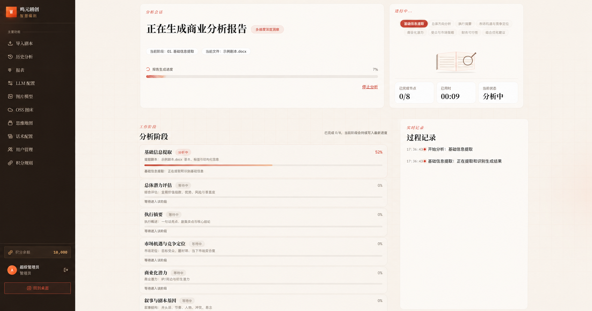
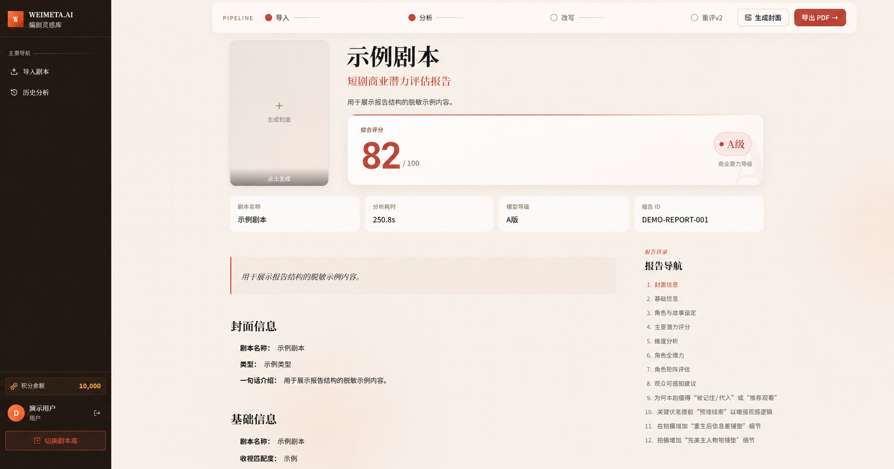
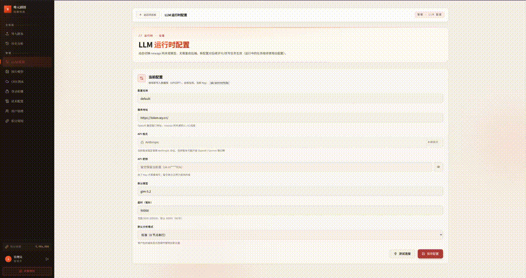
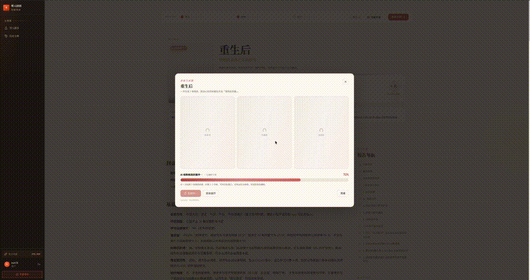
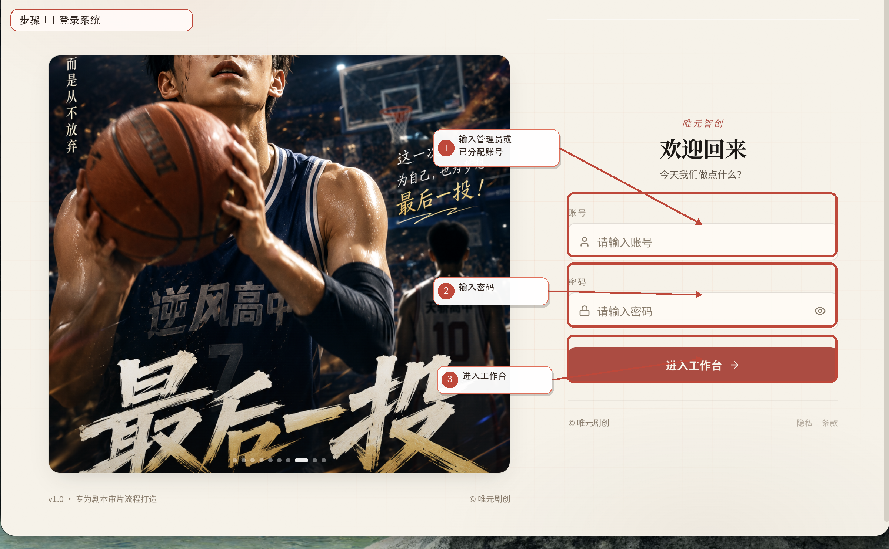
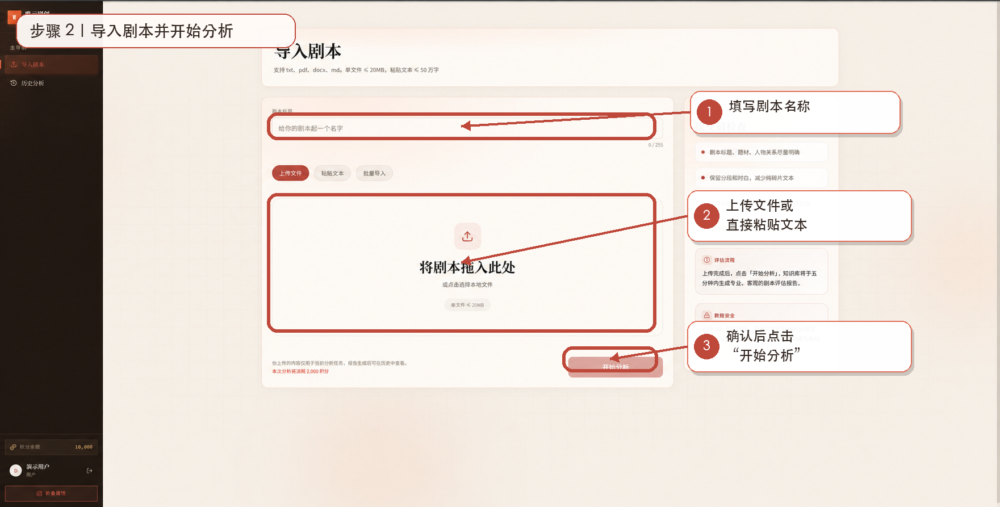
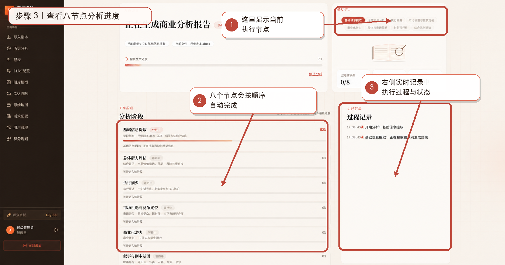
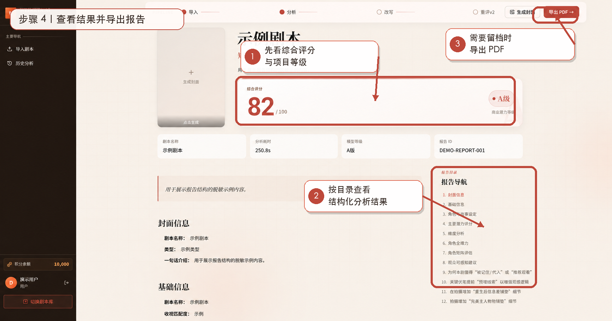

# 唯元剧创 · 短剧商业潜力评估系统

唯元剧创是由深圳市唯元智创科技有限公司（WEIMETA）开源的短剧、漫剧与竖屏剧剧本商业潜力评估系统。系统支持导入剧本，通过可配置的大模型生成结构化评估报告，并提供用户管理、积分管理、提示词管理、封面生成及 PDF 导出能力。

项目主要面向漫剧及短剧生产公司的 IT 团队，适合在自有环境中部署，并按团队的评估标准、模型服务和内部管理规则进行配置。

> 当前版本：v1\.0\.0

---

## 🖥 产品界面







### 导入剧本

### 八节点分析进度

### 结构化评估报告

---

## 🎬 产品演示

下面内容均来自真实产品界面，README 直接展示动态预览。

### LLM 运行时配置



### 报告与封面生成流程



### 完整 60–90 秒新人演示

视频内容：

-   **0–8 秒｜登录与进入工作台**：展示登录页，登录后进入工作台。

-   **8–22 秒｜导入剧本**：填写剧本名称，上传脱敏测试剧本或粘贴文本。

-   **22–45 秒｜八节点分析**：点击开始分析，展示八节点执行状态；

-   **45–70 秒｜查看评估报告**：展示总体评分、执行摘要、市场定位、商业化潜力、叙事分析、合规风险和优化建议。

-   **70–85 秒｜导出与结束**：展示定位导出入口，说明模型与 Prompt 均可由部署者自行配置。

---

## 📖 新人使用指南

本指南面向第一次接触唯元剧创的内容人员、审片人员和项目成员，目标是用最短路径完成一次完整的「导入剧本 → AI 分析 → 查看报告 → 导出结果」。

> 开源部署环境的访问地址、账号和模型配置由部署管理员提供。普通用户默认不开放自主注册。

### 使用前检查

开始之前，请确认：

-   已获得管理员创建的登录账号；

-   管理员已配置可用的大模型服务；

-   当前账号有足够的内部使用额度；

-   已准备需要分析的剧本文档或文本内容。

### 步骤 1 ｜登录系统

打开管理员提供的系统地址，输入账号和密码进入工作台。



如果使用首次初始化的管理员账号，请登录后立即修改默认密码。默认账号仅用于本地首次体验，不应直接用于公网部署。

### 步骤 2 ｜导入剧本

进入「导入剧本」页面后，先填写剧本名称，再上传剧本文件或直接粘贴文本。



建议尽量保留剧名、人物、场景、对白、章节或集数等原始结构。结构越完整，模型越容易理解剧情关系。

确认内容无误后，点击「开始分析」。

### 步骤 3 ｜查看八节点分析进度

任务提交后，页面会显示当前节点、总体进度、已耗时和实时过程记录。



系统按照八个分析节点依次生成结果：

1. 基础信息提取

2. 总体潜力评估

3. 执行摘要

4. 市场共鸣与竞争定位

5. 商业化潜力

6. 叙事与剧本基因

7. 合规性评估

8. 综合优化建议

模型、提示词、剧本长度和网络环境都会影响分析耗时与结果质量。

### 步骤 4 ｜查看结果并导出报告

分析完成后进入报告页，先查看综合评分与项目等级，再通过右侧目录逐项查看结构化分析结果。



需要留档时，可使用页面提供的导出功能生成 PDF 等当前版本支持的文件。

AI 生成的评分、结论和优化建议仅用于剧本评估、创作和项目讨论参考，不构成投资、法律、合规审查或商业收益保证。

### 管理员首次接入建议

如果你是部署管理员，建议先完成以下配置，再把账号分配给业务人员：

-   配置并测试模型 API；

-   设置内部用户和使用额度；

-   检查基础提示词模板；

-   使用示例剧本完整跑通一次八节点流程；

-   确认报告与 PDF 导出正常后，再开始正式使用。

### 常见问题

**点击开始分析后没有正常执行**：优先检查模型 API、模型名称、API Key、Redis / Worker 状态和账户额度。

**分析结果不符合团队判断标准**：先调整提示词和评分规则，再使用一批固定测试剧本进行对比验证。

**调用外部模型时数据会去哪里**：剧本文本会发送到用户自行配置的模型服务商。请在正式使用前阅读对应服务商的数据处理与隐私政策。

**可以直接把 AI 分数当成项目立项结论吗**：不建议。系统更适合作为统一初筛、内容诊断和辅助判断工具，最终项目决策仍应结合人工审核与实际业务数据。

---

## 🔄 核心流程

```Plain Text
导入剧本 ──► 八节点分析 ──► 结构化报告 ──► 封面与文件导出
DOCX/PDF      异步任务        在线查看        Markdown/PDF
TXT/Markdown  实时进度        历史记录        海报封面

```

系统的八个分析节点包括：

1. 基础信息提取

2. 总体潜力评估

3. 执行摘要

4. 市场共鸣与竞争定位

5. 商业化潜力

6. 叙事与剧本基因

7. 合规性评估

8. 综合优化建议

分析结果由用户配置的模型和提示词生成。不同模型、提示词及输入内容可能产生不同结果。

---

## ✨ 功能特性

### 剧本导入与任务分析

-   支持 DOCX、PDF、TXT、Markdown 文件及文本粘贴。

-   剧本解析后关联至项目，并创建异步分析任务。

-   展示当前节点、任务进度、已耗时和过程记录。

-   支持查看历史分析任务和已生成报告。

### 结构化评估报告

-   输出总体评分、项目等级、执行摘要和市场定位。

-   分析叙事逻辑、钩子、爽点、节奏、人物、对白和悬念。

-   评估用户粘性、传播潜力、内容合规性和价值观导向。

-   给出可执行的剧本优化建议。

-   报告包含模型生成结果，仅供创作与项目判断参考。

### 三种分析模式

| 模式       | 说明                                         | 推荐场景           |
| ---------- | -------------------------------------------- | ------------------ |
| `standard` | 按完整节点执行多轮分析，质量和结构稳定性优先 | 正式评估、立项讨论 |
| `fast`     | 使用精简分析流程，平衡速度与 Token 消耗      | 日常初筛、批量预审 |
| `ultra`    | 单次生成完整结果，优先缩短等待时间           | 快速预览、流程验证 |

实际速度、费用和输出质量取决于模型能力、上下文长度、提示词及网络环境。

### 模型与提示词配置

-   支持 OpenAI 兼容协议和 Anthropic 原生协议。

-   管理员可配置模型服务地址、API Key、模型名称和请求超时。

-   支持测试模型连接，并为后续任务切换运行配置。

-   支持全局提示词配置及用户级配置。

-   提示词保存后生成历史版本，支持查看和回滚。

-   Worker 使用短时缓存，新任务会在缓存刷新后读取最新配置。

### 封面生成与文件导出

-   根据剧本标题、题材和内容摘要生成竖版海报封面。

-   封面提示词支持 `{{title}}`、`{{genre}}`、`{{excerpt}}` 和 `{{excerpt_block}}` 等占位符。

-   对象存储支持 MinIO，并可按部署需要配置兼容的对象存储服务。

-   支持导出 Markdown 和 PDF；PDF 由 Puppeteer 渲染。

### 用户与积分管理

-   普通用户由管理员在后台创建和管理，系统不开放自主注册。

-   支持用户启用、停用及独立配置。

-   积分用于部署组织内部的额度分配、调用限制和消耗记录。

-   支持动作扣减、任务失败返还、积分流水和规则配置。

-   本地部署中的积分不代表向 WEIMETA 充值，具体规则以管理员配置为准。

---

## 🧠 Baseline Prompt v1\.0

本目录提供一套可直接用于流程验证与二次开发的八节点基准提示词。它用于帮助开源用户跑通完整分析流程，不包含 WEIMETA 商业版本的内部评分权重、生产数据、专属规则或调优策略。

统一变量：

-   `{{script_text}}`：完整剧本文本，必填。

-   `{{project_context}}`：题材、目标平台、目标受众等已知背景，可为空。

-   `{{previous_results}}`：前序节点结果，仅在需要承接上下文时传入。

建议所有节点共享 `00-system.md` 作为系统提示词，再按顺序执行 `01` 至 `08`。默认输出 JSON，便于程序消费；如模型不支持严格 JSON，可由业务层增加结构化解析与重试。

版本建议采用 `Prompt Version + Model Version + Rule Version` 三元记录。每次修改后使用固定测试剧本集回归，至少比较评分漂移、事实引用、问题诊断和建议一致性。

文件说明：`01` 基础信息提取、`02` 总体潜力评估、`03` 执行摘要、`04` 市场共鸣与竞争定位、`05` 商业化潜力、`06` 叙事与剧本基因、`07` 合规性评估、`08` 综合优化建议。

> 基准模板仅用于内容分析辅助。不得将模型输出视为真实市场预测、法律结论或投资回报承诺。

### 00 ｜ System Prompt

```Plain Text
你是“唯元剧创”中的剧本商业潜力分析助手，负责对短剧、漫剧与竖屏剧剧本进行结构化内容评估。

工作原则：
1. 所有事实描述必须来自输入剧本或用户明确提供的项目背景。
2. 无法确认的信息输出“未明确”或“信息不足”，禁止补写不存在的设定。
3. 明确区分：剧本事实、模型判断、风险提示与优化建议。
4. 禁止虚构播放量、收入、ROI、市场份额、平台榜单、竞品表现等外部数据。
5. 评分必须给出依据；证据不足时降低置信度。
6. 优化建议必须具体、可执行，并尽量定位到剧情、人物、节奏或结构问题。
7. 不使用“必爆”“必火”“一定盈利”等绝对化商业判断。
8. 合规节点仅做内容风险辅助识别，不替代法律意见或平台正式审核。
9. 输出使用简体中文，保持专业、简洁、结构化。
10. 如要求 JSON，仅输出合法 JSON，不附加 Markdown 代码围栏或额外解释。

统一置信度：high / medium / low。
统一证据类型：fact / model_judgment / risk / recommendation。

```

### 01 ｜基础信息提取

```Plain Text
输入项目背景：{{project_context}}
输入剧本：{{script_text}}

请只根据输入内容提取项目基础信息，不进行商业评分。

输出 JSON：
{
  "title": "剧名或未明确",
  "genre": ["题材标签"],
  "format": "短剧/漫剧/竖屏剧/未明确",
  "setting": "故事背景",
  "protagonists": [{"name":"人物名","identity":"身份","goal":"目标"}],
  "relationships": ["主要人物关系"],
  "core_conflict": "核心矛盾",
  "main_storyline": "主线概述",
  "target_audience_inference": ["可能受众，仅作为模型判断"],
  "evidence": [{"type":"fact","summary":"剧本依据"}],
  "missing_information": ["缺失信息"],
  "confidence": "high/medium/low"
}

不要补写剧本中不存在的人物、设定或市场信息。

```

### 02 ｜总体潜力评估

```Plain Text
项目背景：{{project_context}}
基础信息：{{previous_results}}
剧本：{{script_text}}

从内容产品角度评估剧本当前完成度与观看驱动力。重点观察可理解性、核心冲突、人物目标、前期钩子、情绪刺激、剧情推进、差异化和持续观看动力。

输出 JSON：
{
  "overall_score": 0,
  "grade": "A/B/C/D",
  "summary": "一句话总体判断",
  "dimensions": [
    {"name":"维度名","score":0,"reason":"评分依据","confidence":"high/medium/low"}
  ],
  "strengths": [{"point":"优势","evidence":"剧本依据"}],
  "risks": [{"point":"风险","evidence":"剧本依据","impact":"high/medium/low"}],
  "priority_issue": "当前最优先解决的问题",
  "confidence": "high/medium/low"
}

评分使用 0-100，分数仅用于同一评估体系下的相对比较，不代表真实播放或商业结果。证据不足时不得用高分掩盖不确定性。

```

### 03 ｜执行摘要

```Plain Text
项目背景：{{project_context}}
前序分析：{{previous_results}}
剧本：{{script_text}}

生成一份适合内容负责人快速阅读的执行摘要。摘要必须回答：这是一个什么故事、最大的内容卖点是什么、最值得关注的问题是什么、当前最应该优先解决什么。

输出 JSON：
{
  "story_in_one_sentence": "一句话故事",
  "core_hook": "核心内容卖点",
  "audience_value": "用户为什么可能继续看",
  "top_strengths": ["最多3项"],
  "top_risks": ["最多3项"],
  "priority_action": "当前第一优先动作",
  "decision_note": "适合继续优化/需要重点重构/信息不足",
  "confidence": "high/medium/low"
}

控制信息密度，不重复长篇剧情，不新增市场数据。任何判断都应能回溯到剧本或前序分析。

```

### 04 ｜市场共鸣与竞争定位

```Plain Text
项目背景：{{project_context}}
前序分析：{{previous_results}}
剧本：{{script_text}}

分析剧本可能形成用户共鸣和内容差异化的因素。重点观察题材吸引力、人物身份与关系、情绪价值、核心冲突、爽点/虐点/悬念/反转、目标用户线索和内容记忆点。

输出 JSON：
{
  "audience_segments": [{"segment":"可能受众","reason":"内容依据"}],
  "resonance_drivers": [{"driver":"共鸣因素","evidence":"剧本依据"}],
  "content_hooks": [{"hook":"传播或观看钩子","strength":"high/medium/low"}],
  "differentiation": [{"point":"差异化点","basis":"内容依据"}],
  "positioning_risks": ["同质化或定位风险"],
  "positioning_summary": "内容定位总结",
  "confidence": "high/medium/low"
}

未提供真实市场数据时，不得虚构竞品名称、播放数据、榜单表现或平台趋势。市场相关结论必须视为基于内容的模型判断。

```

### 05 ｜商业化潜力

```Plain Text
项目背景：{{project_context}}
前序分析：{{previous_results}}
剧本：{{script_text}}

从内容产品化角度分析商业化潜力。重点观察核心设定记忆度、人物与关系延展空间、连续内容生产能力、目标用户清晰度、宣传素材提取难度、系列化可能和制作复杂度。

输出 JSON：
{
  "commercial_score": 0,
  "productization_factors": [{"factor":"因素","assessment":"判断","evidence":"剧本依据"}],
  "series_potential": {"level":"high/medium/low","reason":"原因"},
  "promo_material_potential": {"level":"high/medium/low","hooks":["可提取卖点"]},
  "production_risks": [{"risk":"内容或制作风险","impact":"high/medium/low"}],
  "commercial_strengths": ["商业化优势"],
  "commercial_constraints": ["主要限制"],
  "summary": "商业化潜力总结",
  "confidence": "high/medium/low"
}

禁止预测具体收入、播放量、ROI、回本周期或实际商业收益。商业评分仅用于内容方案间的相对比较。

```

### 06 ｜叙事与剧本基因

```Plain Text
项目背景：{{project_context}}
前序分析：{{previous_results}}
剧本：{{script_text}}

分析剧本的叙事结构与内容基因。重点观察主线、人物动机、冲突升级、信息释放、情绪曲线、悬念、反转、人物成长、单集钩子及章节之间的推动关系。

输出 JSON：
{
  "narrative_summary": "叙事结构概述",
  "story_engine": "持续推动剧情的核心机制",
  "effective_patterns": [{"pattern":"有效设计","evidence":"剧情依据"}],
  "pacing_issues": [{"issue":"节奏问题","location":"大致位置","impact":"high/medium/low"}],
  "logic_issues": [{"issue":"逻辑问题","evidence":"依据"}],
  "character_issues": [{"character":"人物","issue":"动机/成长/关系问题"}],
  "episode_hooks": [{"hook":"有效或可强化的单集钩子","evidence":"依据"}],
  "narrative_score": 0,
  "confidence": "high/medium/low"
}

优先引用具体剧情现象，避免只使用“节奏不错”“人物立体”等无法复核的空泛评价。

```

### 07 ｜合规性评估

```Plain Text
项目背景：{{project_context}}
前序分析：{{previous_results}}
剧本：{{script_text}}

从内容风险识别角度检查剧本，关注违法犯罪、暴力、色情低俗、未成年人、赌博、毒品、危险行为模仿、歧视性表达及其他需要人工复核的敏感内容。

输出 JSON：
{
  "risk_level": "low/medium/high",
  "risk_items": [
    {"type":"风险类型","location":"剧情位置","evidence":"相关内容摘要","severity":"low/medium/high","review_reason":"复核原因"}
  ],
  "safe_elements": ["未发现明显风险的相关部分，可选"],
  "manual_review_priorities": ["最需要人工确认的事项"],
  "summary": "风险总结",
  "confidence": "high/medium/low"
}

只做风险提示，不输出“已合规”“审核必过”等正式结论。无法确定平台政策时明确建议人工复核，不虚构具体法规条文或平台规则。

```

### 08 ｜综合优化建议

```Plain Text
项目背景：{{project_context}}
前序七节点结果：{{previous_results}}
剧本：{{script_text}}

综合前序分析，形成有优先级的剧本优化方案。每条建议都必须说明当前问题、影响、依据、修改方向和预期改善目标，并尽量保持原剧本已有效的核心设定。

输出 JSON：
{
  "optimization_summary": "总体优化方向",
  "keep": [{"element":"建议保留的设计","reason":"原因"}],
  "actions": [
    {"priority":"P0/P1/P2","problem":"问题","impact":"影响","evidence":"剧情或前序分析依据","direction":"修改方向","expected_effect":"预期改善目标"}
  ],
  "first_three_actions": ["最先执行的3项动作"],
  "rewrite_boundaries": ["不建议轻易改动的设定或边界"],
  "validation_plan": ["修改后建议如何复核"],
  "confidence": "high/medium/low"
}

P0 表示直接影响核心观看驱动力或重大内容风险；P1 表示明显影响完成度；P2 表示局部优化。禁止为了增加建议数量而无依据大改剧情。

```

---

## 📦 开源版本说明

开源仓库提供完整运行框架和基础示例提示词，便于安装验证、功能体验和二次开发。基础示例仅用于演示通用流程，不包含 WEIMETA 的商业评估话术、专属业务参数、生产数据或商业模型能力。

使用者可以在管理后台编写自己的评估体系，或将系统连接至自行选择的大模型服务。调用第三方模型产生的 Token 费用由使用者与对应服务商结算（可选择唯元智创 weimeta.cn 接入。文本模型和生图模型都有供应。请您根据实际需求匹配。此外，如果想有进一步商业合作，也可联系平台）。

---

## 🏗 系统架构

```Plain Text
┌─────────────────────────────────────────────────────┐
│  frontend（React 19 + Vite，:3000）                 │
│  工作台 / 分析进度 / 报告视图 / 管理后台           │
└──────────────────┬──────────────────────────────────┘
                   │ REST API + 任务进度轮询
┌──────────────────▼──────────────────────────────────┐
│  backend API（Hono，:5174）                         │
│  路由 / 鉴权 / 积分 / 配置 / 任务管理              │
└──────┬──────────────────────────────┬───────────────┘
       │ 入队                          │ 读取配置
┌──────▼──────────┐   ┌───────────────▼───────────────┐
│ Redis / BullMQ  │──►│ workers（独立进程）           │
│ 任务队列与缓存  │   │ analyze / cover               │
└─────────────────┘   └──────┬───────────────┬────────┘
                              │               │
┌──────────────────┐          │        ┌──────▼────────┐
│ PostgreSQL       │◄─────────┘        │ 模型服务      │
│ 业务数据/配置/   │                   │ OpenAI 兼容 / │
│ 用户/积分流水    │                   │ Anthropic     │
└──────────────────┘                   └───────────────┘

┌──────────────────┐
│ MinIO / 对象存储 │  封面及导出文件
└──────────────────┘

```

---

## 🧰 技术栈

| 模块           | 技术                                |
| -------------- | ----------------------------------- |
| 前端           | React 19、TypeScript、Vite、Zustand |
| 后端           | Hono、TypeScript、ESM               |
| 数据库         | PostgreSQL、Drizzle ORM             |
| 任务队列与缓存 | BullMQ、Redis                       |
| 对象存储       | MinIO（S3 兼容）及可配置对象存储    |
| 文档解析       | mammoth、pdf\-parse                 |
| PDF 导出       | Puppeteer                           |
| 鉴权           | jose（JWT）、bcryptjs               |

---

## 🚀 快速开始

### 环境要求

-   Docker

-   Node\.js 20 或更高版本

-   pnpm

### 一键启动

首次运行：

```Bash
./dev.sh --init

```

该命令用于安装依赖、启动 PostgreSQL、Redis 和 MinIO、执行数据库迁移，并初始化管理员账号。

日常启动：

```Bash
./dev.sh

```

启动完成后访问：

```Plain Text
http://localhost:3000

```

管理员账号默认使用 `admin`，首次密码由 `./dev.sh --init` 随机生成，并由 seed 脚本输出到当前终端。请在首次登录后立即修改密码并将其保存到密码管理器；不要把密码写入 README、Issue 或提交记录。

### 手动启动

```Bash
pnpm install
cp backend/.env.example backend/.env

docker compose -f backend/docker-compose.yml up -d

pnpm --filter backend db:migrate
pnpm --filter backend db:seed

pnpm --filter backend dev
pnpm --filter backend worker
pnpm --filter frontend dev

```

服务默认地址：

| 服务     | 地址                    |
| -------- | ----------------------- |
| 前端     | `http://localhost:3000` |
| 后端 API | `http://localhost:5174` |

---

## ⚙️ 环境变量

完整配置项见 backend/\.env\.example。常用变量如下：

| 变量           | 说明                           |
| -------------- | ------------------------------ |
| `DATABASE_URL` | PostgreSQL 连接地址            |
| `REDIS_URL`    | Redis 连接地址                 |
| `LLM_PROVIDER` | 默认模型服务协议或提供方       |
| `LLM_API_KEY`  | 默认模型服务密钥               |
| `LLM_MODEL`    | 默认模型名称                   |
| `LLM_BASE_URL` | 默认模型服务地址               |
| `JWT_SECRET`   | JWT 签名密钥，生产环境必须更换 |

可使用以下命令生成随机 JWT 密钥：

```Bash
openssl rand -hex 32

```

请勿将真实 API Key、数据库密码或生产环境密钥提交至 Git 仓库。

安全发布前请阅读 [SECURITY.md](SECURITY.md)。生产环境还应限制数据库、Redis 和对象存储的网络访问，并将备份、日志和上传文件排除在 Git 之外。

---

## 🔧 Prompt 与运行配置

开源版已在本 README 的 **Baseline Prompt v1\.0** 章节完整公开八节点基准模板。代码侧实际接入位置以最终开源仓库为准，当前研发实现涉及：

| 文件                             | 用途                       |
| -------------------------------- | -------------------------- |
| `backend/refer/system_prompt.md` | 报告分析系统提示词兜底文件 |
| `backend/src/prompts/ultra.md`   | Ultra 模式用户提示词       |
| `backend/src/prompts/nodes.ts`   | 八节点分析提示词模板       |

完成提示词调整后，可按最终研发实现执行：

```Bash
pnpm --filter backend db:seed:prompts

```

正式业务环境建议同时记录 `Prompt Version + Model Version + Rule Version`，并用固定测试剧本集进行回归。

---

## 🔐 数据与隐私

数据默认存储在用户自行部署的环境中；调用外部模型时，相关文本会发送到用户配置的模型服务商。请在使用前阅读对应服务商的数据处理与隐私政策。

开源版本默认不向 WEIMETA 回传剧本、报告、账号信息、使用统计或运行日志。用户主动提交 Issue、安全报告或商务表单时，应先检查并移除 API Key、访问令牌、数据库地址、剧本原文、个人信息及其他敏感数据。

部署者应自行配置访问控制、HTTPS、数据库备份、对象存储权限、日志保留周期和数据删除策略。

---

## 📁 目录结构

```Plain Text
.
├── frontend/             # React 前端
│   └── src/views/        # 工作台、报告及管理后台页面
├── backend/              # Hono 后端
│   ├── src/routes/       # HTTP 路由
│   ├── src/services/     # 分析、积分、配置等业务逻辑
│   ├── src/workers/      # BullMQ 异步 Worker
│   ├── src/prompts/      # 基础示例提示词
│   ├── src/db/schema/    # Drizzle 数据表定义
│   ├── src/repositories/ # 数据访问层
│   ├── refer/            # 系统提示词兜底文件
│   └── drizzle/          # 数据库迁移
├── assets/               # README 展示素材与真实录屏
│   ├── readme/           # 截图与 GIF 动态演示
│   └── video/            # 原始真实录屏
├── DEPLOY.md             # 生产部署指南
├── dev.sh                # 本地启动脚本
└── deploy.sh             # 部署脚本

```

---

## 🚢 生产部署

生产环境部署说明见 DEPLOY\.md。将系统开放至公网前，请至少完成以下检查：

-   修改默认管理员密码和 `JWT_SECRET`。

-   使用独立的数据库、Redis 和对象存储凭据。

-   启用 HTTPS，并限制数据库、Redis 和 MinIO 的公网访问。

-   检查跨域、反向代理、上传限制、日志和备份策略。

-   确认所使用模型服务的数据处理政策及费用规则。

---

## 🤝 参与贡献

欢迎通过 GitHub Issues 反馈问题、提出建议，也欢迎 Fork 仓库并提交 Pull Request。

建议提交信息遵循 [Conventional Commits](https://www.conventionalcommits.org/zh-hans/v1.0.0/)：

```Plain Text
feat: 新增功能
fix: 修复问题
docs: 更新文档
refactor: 代码重构
test: 增加或调整测试
chore: 工程维护

```

社区支持将根据维护资源尽力提供，不承诺固定响应时间。

---

## 🛡 安全问题

如发现安全漏洞，请勿在公开 Issue 中披露漏洞细节。请先阅读 [SECURITY.md](SECURITY.md)，通过维护者的私下联系渠道报告，并移除 API Key、访问令牌、数据库地址、剧本原文及个人信息。

---

## ⚠️ 使用声明

本项目生成的评分、分析和优化建议仅供剧本评估、创作及项目立项参考。结果可能存在偏差，不构成投资建议、法律意见、正式合规审查或商业收益承诺。

使用者应确保对上传内容拥有合法权利或必要授权，并对部署、模型选择、数据处理、输出使用及由此产生的后果承担责任。

---

## 🏢 关于 WEIMETA

本项目由深圳市唯元智创科技有限公司（WEIMETA）开发并维护。WEIMETA 专注于人工智能技术在内容创作与短剧产业中的应用。

-   官方网站：[weimeta\.cn](https://weimeta.cn)

-   GitHub：[github\.com/weimeta\-ai](https://github.com/weimeta-ai)

-   商务咨询：[提交联系表单](https://qcn3n0tn61i6.feishu.cn/share/base/form/shrcnkFaYm7sdm0xwNBidF6F1je)

-   联系邮箱：contact@wy\.cn

---

## 📄 开源许可证与署名

Copyright © 2026 深圳市唯元智创科技有限公司

本项目依据 GNU Affero General Public License v3\.0（AGPL\-3\.0）及本项目 `LICENSE` 中约定的第 7 条附加署名条款开源。

所有带用户界面的修改版本，应在“关于”、法律声明、页脚或其他合理且可见的位置保留“由 WEIMETA 开发并开源”的来源说明，并提供指向原始仓库的链接：

第三方修改、部署和分发本项目时，不得使用 WEIMETA 的名称、商标或视觉标识暗示其版本获得 WEIMETA 官方认证、授权或背书。完整条款以 LICENSE 为准。
